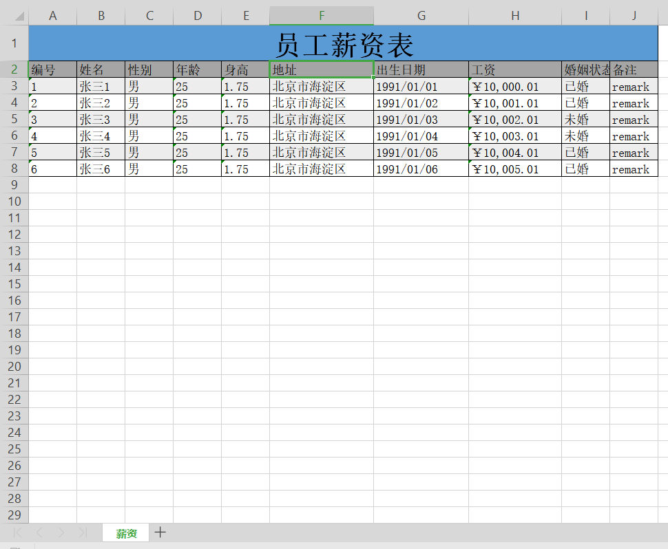

## 解析工具包

解析xml，excel、csv、txt等格式的文件数据为Java Bean

## Demo

### xml解析

使用`xin.common.parse.xml.annotation.XmlField`注解标注`bean`的属性

 **实体bean**

```java
import lombok.Data;
import lombok.ToString;
import xin.common.parse.xml.annotation.XmlField;

import java.math.BigDecimal;
import java.util.Date;

/**
 * <pre>
 * 测试试实体-Person
 * </pre>
 *
 * @author lixin_ma@outlook.com
 * @version 1.0
 * @since 2019/5/14 21:36
 */
@Data
@ToString
public class Person {

    @XmlField
    private Long id;

    @XmlField
    private String name;

    @XmlField
    private String sex;

    @XmlField
    private Integer age;

    @XmlField
    private Float height;

    @XmlField
    private String address;

    /**
     * 日期类型
     * 可以通过format属性 设置转换需要的日期格式。
     */
    @XmlField(format = "yyyy/MM/dd")
    private Date birthday;

    @XmlField
    private BigDecimal salary;

    /**
     * BigDecimal类型
     * 如果有精度要求，通过 scal 属性设置精度，通过 roundingMode 属性设置舍入模式
     * 当输入精度后，舍入模式 如果不输入，默认使用4 ，即 ROUND_HALF_UP
     */
    @XmlField(scale = "2",roundingMode = BigDecimal.ROUND_FLOOR)
    private BigDecimal monthSalary;

    @XmlField(scale = "4")
    private BigDecimal yearSalary;
 	
    /**
     * name -映射xml中的tag名称，为空时，默认取字段字段名
     */
    @XmlField(name = "ismarriage")
    private Boolean isMarriage;

    /**
     * 日期类型
     * 可以通过format属性 设置转换需要的日期格式
     */
    @XmlField(format = "yyyy-MM-dd HH:mm:ss")
    private Date crtTime;

    /**
     * 非解析字段
     */
    private String remark;
}
```

**xml文件**

```xml
<?xml version="1.0" encoding="utf-8" standalone="yes" ?>
<person>
    <id>1567890</id>
    <name>张三</name>
    <sex>男</sex>
    <age>28</age>
    <height>1.75</height>
    <address>北京市海淀区</address>
    <birthday>1991/10/04</birthday>
    <salary>12345.4325</salary>
    <monthSalary>370,362.975</monthSalary>
    <yearSalary>4,444,355.7</yearSalary>
    <ismarriage>false</ismarriage>
    <crtTime>2019-05-14 21:29:44</crtTime>
</person>
```

**解析demo**

```java
import lombok.extern.slf4j.Slf4j;
import org.junit.Assert;
import org.junit.Test;
import xin.common.parse.XmlParser;

/**
 * <pre>
 * 测试解析
 * </pre>
 *
 * @author lixin_ma@outlook.com
 * @version 1.0
 * @since 2019/5/14 21:49
 */
@Slf4j
public class TestParse {

    @Test
    public void test(){
        String path = getClass().getResource("/person.xml").getFile();
        XmlParser parser = new XmlParser();
        Person person = parser.parse(path,Person.class);
        log.info("parse test resource person.xml to java Person bean :{}",person.toString());
        Assert.assertNotNull("Person is null",person);
        Assert.assertNotNull("Person attr salary is wrong","12345.4325".equals(person.getYearSalary().toPlainString()));
        Assert.assertNotNull("Person attr monthSalary is wrong","370362.97".equals(person.getYearSalary().toPlainString()));
        Assert.assertNotNull("Person attr yearSalary is wrong","4444355.7000".equals(person.getYearSalary().toPlainString()));
    }
}
```

person解析后各字段值：

```json
{
    "id": 1567890, 
    "name": "张三", 
    "sex": "男", 
    "age": 28, 
    "height": 1.75, 
    "address": "北京市海淀区", 
    "birthday": "Fri Oct 04 00:00:00 CST 1991", 
    "salary": 12345.4325, 
    "monthSalary": 370362.97, 
    "yearSalary": 4444355.7, 
    "isMarriage": false, 
    "crtTime": "Tue May 14 21:29:44 CST 2019", 
    "remark": null
}
```

### Excel

**实体 bean**

```java
import lombok.Data;
import lombok.ToString;
import xin.common.parse.excel.annotation.CellConfig;
import xin.common.parse.excel.annotation.DataType;

import java.math.BigDecimal;
import java.util.Date;

/**
 * <pre>
 * 测试试实体-Person
 * </pre>
 *
 * @author lixin_ma@outlook.com
 * @version 1.0
 * @since 2019/5/14 21:36
 */
@Data
@ToString
public class Person {
	/**
     * aliasName - 导出后的列别名，为空时取属性名
     * index - 下标值，从0开始
     *         index值为-1，表示解析excel时去根据这个字段取数（即这个字段不是excel中的列）
     */
    @CellConfig(aliasName = "编号",index = 0)
    private Long id;

    /**
     * required - 解析excel cell的必填标识，用于限制参数是否为必填。true为必填，默认false
     */
    @CellConfig(aliasName = "姓名",index = 1,required = true)
    private String name;

    @CellConfig(aliasName = "性别",index = 2)
    private String sex;

    @CellConfig(aliasName = "年龄",index = 3)
    private Integer age;

    @CellConfig(aliasName = "身高",index = 4,required = true)
    private Float height;

    @CellConfig(aliasName = "地址",index = 5)
    private String address;

    /**
     * dataType - 数据类型 - {@link xin.common.parse.excel.annotation.DataType}
     * pattern - 格式化模板，与dataType配套使用
     */
    @CellConfig(aliasName = "出生日期",index = 6,dataType=DataType.date,pattern = "yyyy/MM/dd")
    private Date birthday;

    @CellConfig(aliasName = "工资",index = 7,dataType=DataType.currency)
    private BigDecimal salary;

    /**
     * omit - 导出excel，字段是否忽略。true为忽略，默认false
     */
    @CellConfig(index = 8,omit = true)
    private BigDecimal salary1;

    @CellConfig(index = 9,omit = true)
    private BigDecimal salary2;

    /**
     * statusValue - 状态值描述(JSON字符串)
     * 这里除了可以定义状态的映射值以外还可以定义背景色 - key->"bgColor"
     * 也可以扩展一下 自己定义一些其他的属性。
     */
    @CellConfig(aliasName = "婚姻状态",index = 10,statusValue = "{true: {text:\"已婚\"},false:{text:\"未婚\"}}")
    private Boolean isMarriage;

    @CellConfig(index = 11,omit = true)
    private Date crtTime;
    
    @CellConfig(aliasName = "备注",index = 12)
    private String remark;
}

```

**解析 demo**

```java
@Test
public void testExcel(){
    /**
     * 解析
     */
    String path = getClass().getResource("/person.xls").getFile();
    ExcelParser parser = new ExcelParser();
    parser.registerConverter(Date.class,new DateFieldConverter("yyyy/MM/dd"));
    stream = parser.parseStream(path,Person.class);
    Assert.assertNotNull("parse result stream is null",stream);
    List<Person> beans =  stream.collect(Collectors.toList());
    beans.forEach(person -> {
        Assert.assertNotNull("Person is null",person);
        log.info("parse test resource person.xls to java Person bean : {}",person.toString());
    });
    
    /**
     * 导出
     */
    ExcelExporter exporter = new ExcelExporter();
    try {
        String export = getClass().getResource("").getFile() + "export.xls";
        log.info("export : {}",export);
        exporter.parseBeansToExcel(beans,export ,"员工薪资表","薪资",Person.class);
    } catch (IOException | InvalidFormatException e) {
        e.printStackTrace();
    }
}
```

person.xls 解析后各字段值：

```json
[{
		"address": "北京市海淀区",
		"age": 25,
		"birthday": 662659200000,
		"crtTime": 1557763200000,
		"height": 1.75,
		"id": 1,
		"isMarriage": true,
		"name": "张三1",
		"remark": "remark",
		"salary": 10000.01,
		"salary1": 10000.02,
		"salary2": 10000.03,
		"sex": "男"
	}, {
		"address": "北京市海淀区",
		"age": 25,
		"birthday": 662745600000,
		"crtTime": 1557763200000,
		"height": 1.75,
		"id": 2,
		"isMarriage": true,
		"name": "张三2",
		"remark": "remark",
		"salary": 10001.01,
		"salary1": 10001.02,
		"salary2": 10001.03,
		"sex": "男"
	}, {
		"address": "北京市海淀区",
		"age": 25,
		"birthday": 662832000000,
		"crtTime": 1557763200000,
		"height": 1.75,
		"id": 3,
		"isMarriage": false,
		"name": "张三3",
		"remark": "remark",
		"salary": 10002.01,
		"salary1": 10002.02,
		"salary2": 10002.03,
		"sex": "男"
	}, {
		"address": "北京市海淀区",
		"age": 25,
		"birthday": 662918400000,
		"crtTime": 1557763200000,
		"height": 1.75,
		"id": 4,
		"isMarriage": false,
		"name": "张三4",
		"remark": "remark",
		"salary": 10003.01,
		"salary1": 10003.02,
		"salary2": 10003.03,
		"sex": "男"
	}, {
		"address": "北京市海淀区",
		"age": 25,
		"birthday": 663004800000,
		"crtTime": 1557763200000,
		"height": 1.75,
		"id": 5,
		"isMarriage": true,
		"name": "张三5",
		"remark": "remark",
		"salary": 10004.01,
		"salary1": 10004.02,
		"salary2": 10004.03,
		"sex": "男"
	}, {
		"address": "北京市海淀区",
		"age": 25,
		"birthday": 663091200000,
		"crtTime": 1557763200000,
		"height": 1.75,
		"id": 6,
		"isMarriage": true,
		"name": "张三6",
		"remark": "remark",
		"salary": 10005.01,
		"salary1": 10005.02,
		"salary2": 10005.03,
		"sex": "男"
	}
]
```

 导出为export.xls：



### CSV

待整理

### Txt

待整理


